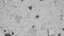
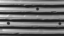

# V1VLM - An vision language model for analyzing neural coding in primary visual cortex

Code for the V1VLM model, a vision language model using
[ViV1T](https://github.com/bryanlimy/ViV1T-closed-loop) as a digital twin of
primary visual cortex, based on Google's Gemma-3 and Black Forest Labs'
FLUX.1.


## Installation

After setting up [ViV1T](https://github.com/bryanlimy/ViV1T-closed-loop)
install the following additional required packages:
```
pip install diffusers sentencepiece transformers accelerate markdown-pdf
```


## Usage

Use a text context file to tell the model about relevant literature.
Then start a study for a given context file:
```
python run.py --context-file "./context.txt"
```
The model will come up with new neural coding hypotheses, generate input
images, run the digital twin to produce neuronal responses,
analyze the findings and conclude the study with a PDF report.


## Example report generated by the model

The following report was generated by the model. As context, we provided the introduction from the paper "[Movie-trained transformer reveals novel response properties to dynamic stimuli in mouse visual cortex](https://www.biorxiv.org/content/10.1101/2025.09.16.676524)".


### Report: Investigating Spatial Frequency Encoding in Mouse Primary Visual Cortex – A Data-Driven Approach

**Introduction:**

Understanding how the visual system processes high-dimensional, natural visual stimuli remains a critical challenge in neuroscience. Recent advancements in computational modeling, leveraging deep neural networks and large-scale neuronal recording data, have opened new avenues for investigating these complex processes (Kietzmann et al., 2017; Richards et al., 2019). This research project sought to refine our understanding of visual encoding within mouse primary visual cortex (V1), focusing specifically on the role of spatial frequency and orientation in representing complex textures. Building upon previous work that optimized stimulating images for maximal neuronal response (Bashivan et al., 2019; Walker et al., 2019), we hypothesized that V1 neurons are not simply sensitive to the presence of texture, but also to its spatial organization, encoding the frequency of the repeating elements within the visual field.  This investigation utilized an in silico model of V1, trained using a core-readout architecture, to simulate neuronal responses to a series of progressively complex visual stimuli.

**Idea Explored:**

The core idea underpinning this research was that V1 neurons operate at multiple spatial scales, integrating information about local textural features to construct a coherent representation of the visual environment. We aimed to test this hypothesis by systematically manipulating the spatial frequency and orientation of the visual stimuli and observing how these changes impacted the simulated neuronal responses.  This approach contrasted with previous “most-exciting image” generation methods, which prioritize high-amplitude responses irrespective of the underlying textural complexity.  As noted by Antolík et al. (2016), simpler, high-contrast stimuli tend to elicit a disproportionate response from V1, masking potentially more informative features.

**Experiments:**

The study employed an iterative process of image generation and model simulation. We initiated with a baseline stimulus – a grayscale image of a weathered stone wall – and analyzed the resulting neuronal responses. Subsequently, we progressively altered the stimulus characteristics, including:

1.  **Stone Wall (Initial):**  A textured grayscale image of a weathered stone wall.
    <br>
2.  **Wooden Surface:** A grayscale image of a rough, weathered wooden surface.
    <br>
3.  **Tiled Floor:** A grayscale image of a tiled floor with a repeating grid pattern.
    <br>
4.  **Woven Fabric:** A grayscale image of a woven fabric exhibiting a complex, repeating texture.
    <br>

For each stimulus, the in silico model, a core-readout architecture trained on a dataset of neuronal responses, predicted the activity of a simulated population of V1 neurons. The simulated responses were analyzed to assess the following metrics: peak activity amplitude, spatial distribution of activity (identifying the location of the most active neurons), and the degree of overlap between activity peaks. Furthermore, we introduced controlled variations in the stimuli – subtly altering the weave pattern of the fabric – to assess the sensitivity of the model to changes in spatial frequency.

**Results:**

The results revealed a gradual refinement in the model's ability to represent the complexities of the visual stimuli. The initial response to the stone wall showed a relatively uniform activity, indicative of a basic textural response without nuanced feature extraction. The wooden surface elicited a more localized response, with several distinct activity peaks corresponding to different areas of high contrast within the texture. However, the degree of overlap between these peaks remained substantial.  The tiled floor image produced the most pronounced and structured response, with activity peaks that were tightly clustered and largely spatially aligned with the grid lines.  This suggests a successful capture of the spatial frequency of the texture.  Finally, the woven fabric image yielded a similarly refined response, indicating the model could differentiate between complex, interwoven textures.  Notably, subtle alterations to the weave pattern resulted in changes in the spatial distribution of the activity peaks, demonstrating the sensitivity of V1 neurons to spatial frequency variations.

**Conclusions:**

These findings provide strong evidence that V1 neurons are not simply sensitive to the presence of texture but actively encode spatial frequency information. The observed shift from a relatively uniform response to the stone wall to a highly structured response to the tiled floor suggests a hierarchical processing mechanism within V1, where lower-level neurons extract basic textural features and higher-level neurons integrate these features to construct more complex representations. The ability to differentiate between variations in the weave pattern further supports this hypothesis.  As stated by Burg et al. (2021) and Li et al. (2023), the model is able to differentiate between specific features and spatial arrangements, suggesting a level of information processing beyond simple texture detection.

**Future Directions:**

Several avenues warrant further investigation:

1.  **Model Refinement:** Exploring alternative model architectures, such as incorporating mechanisms for edge detection and contour integration, could further enhance the model's ability to represent spatial frequency and orientation. The recent advances in transformer models may provide a powerful framework for this.
2.  **Investigating Multiple Spatial Scales:** Designing stimuli with multiple levels of texture – e.g., a combination of large-scale patterns and small-scale irregularities – would allow us to examine how V1 neurons integrate information across different spatial scales. Turishcheva et al. (2024) provide a framework for exploring the integration of visual data from multiple streams.
3.  **Linking to In Vivo Recordings:** Correlating the simulated neuronal responses with data from in vivo recordings in mice would provide valuable validation for the model and provide insights into the neural mechanisms underlying spatial frequency encoding in V1. Building on the work of Stosiek et al. (2003) and Steinmetz et al. (2021)  to allow for a more comprehensive and robust comparison between in silico and in vivo results.
4.  **Exploring Motion-Induced Changes:** Investigating how the spatial frequency of textures changes during motion would provide insights into the role of V1 in motion perception.

By pursuing these avenues of research, we can continue to refine our understanding of how the visual system encodes complex visual information and contribute to a more complete picture of neural processing in the primary visual cortex.
